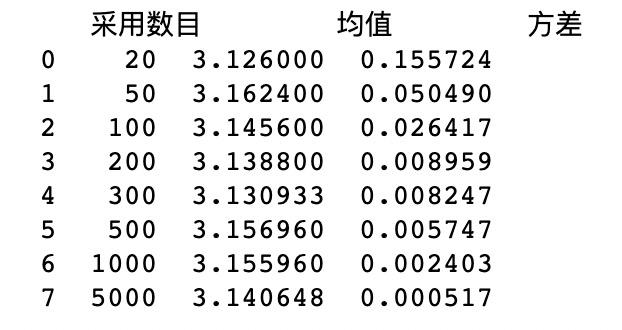

### Assignment 1: Exercises for Monte Carlo Methods

* Lectured by 梁上松, Sun Yat-sen University
* Student ID:   21215122          
* Student Name: 何峙

#### Exercise 1

设圆半径为r，则：
$$\frac{4分圆面积}{正方形面积} = \frac{\frac{1}{4}\pi r^2 }{r^2} = \frac{\pi}{4}=\frac{落在4分圆的点数}{落在正方形点数}$$
即：
$$\pi=\frac{4 * 落在4分圆的点数}{落在正方形点数}$$

实验结果如下：

以下为个采样100个点的分布情况：
