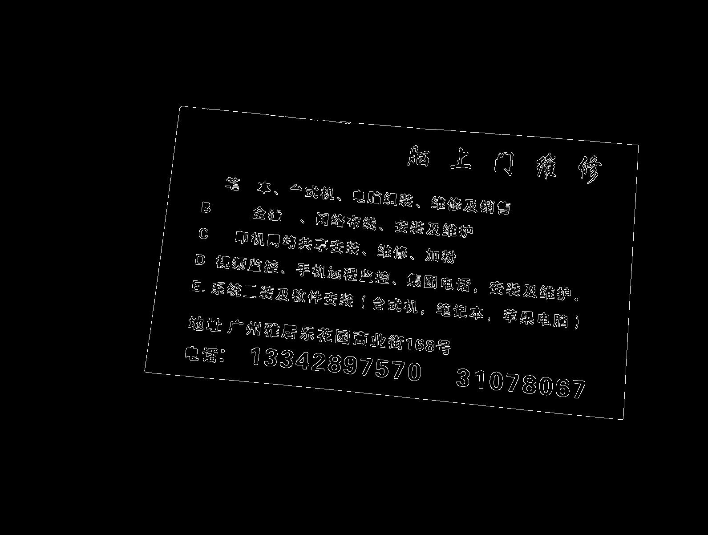
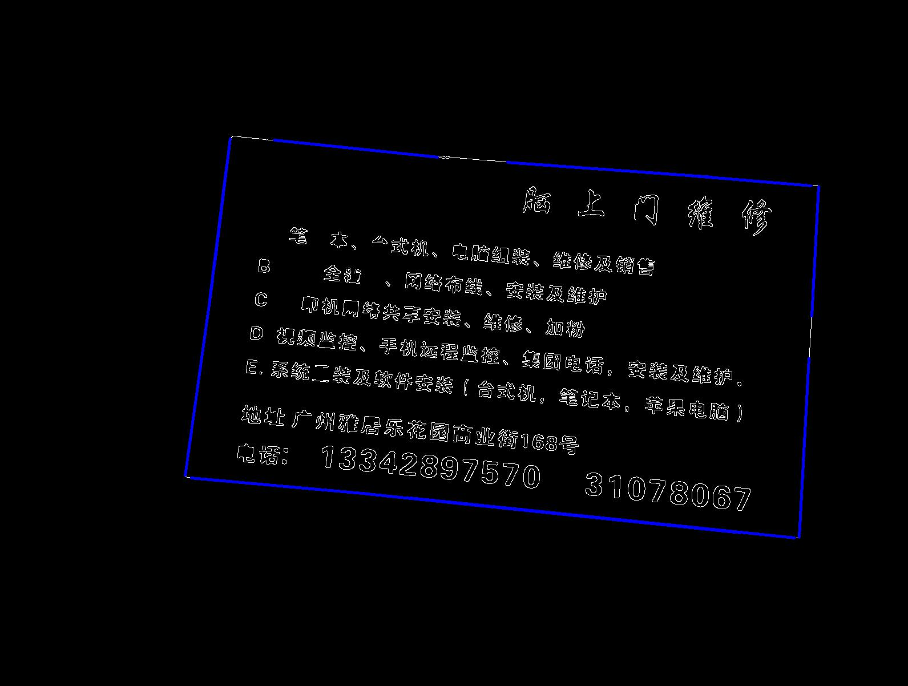

### 作业2实验报告

#### 姓名：何峙
#### 学号：21215122
#### 专业：电子信息-大数据与人工智能
#### 实验步骤：


本实验代码用Python编写，主要使用opencv库。

实验运行：

```
python main.py
```

1.	用Canny算子获取图像边缘点)
先进行高斯模糊去噪点。然后用Canny算子获取名片边缘：

```
image = cv2.imread(imagePath, cv2.IMREAD_UNCHANGED)
imageBlur = cv2.GaussianBlur(image, (3, 3), 1)
imageGray = cv2.cvtColor(imageBlur, cv2.COLOR_BGR2GRAY)
edges = cv2.Canny(imageGray, 60, 400)
```
输出图可查看：


2.	计算名片边缘
* 进行霍夫变换，得出若干线段：

```
lines = cv2.HoughLinesP(cannyImage, 
                        1, 
                        np.pi / 180, 
                        threshold=80,
                        minLineLength=190,
                        maxLineGap=12)
```
返回的线段数量会根据以上方法的参数不同而有所不同。每条线段包括其起点和终点坐标，形如[x1_start, y_start, x_end, y_end]，根据此坐标，可得到霍夫空间中各直线的参数方程：b = -k * x + y

下图绘制边缘的直线：



下图显示相关边缘点：


3.	输出名片的四个角点

这里用的方法是遍历上个步骤的每条线段，根据其斜率分为两类：斜率绝对值小于一个指定阈值则归为A类，否则归为B类，然后在A类中分别找出y坐标的最小最大值，即为边缘上下两条关键线段。同理，在B类中根据x坐标的最小最大值，找到边缘左右两条关键线段。具体代码可参考：代码文件utils.py

```
def find4CrossPointWithLines(lines):
    ...
```

输出角点：


4.	矫正成标准的普通名片

使用warp变换即可名片裁出并摆正：

```
matrix = cv2.getPerspectiveTransform(points1, points2)
imageOut = cv2.warpPerspective(sourceImage, matrix, (width, height))

```


#### 遗留问题

1. 找4个角点的实验中，本人使用的方法不完备：如果名片更加倾斜的摆放，难以找出上下左右4条关键线段，导致最终没法正确找到角点；
2. 图片IMG_20200511_220746.jpg最左边有长边干扰，一直调参也没法“抠”出名片的相关线段；
3. 图片IMG_20160210_103112.jpg背景颜色太杂乱，实验输出不成功；

以上问题实在找不到有效方法，还请老师指教。